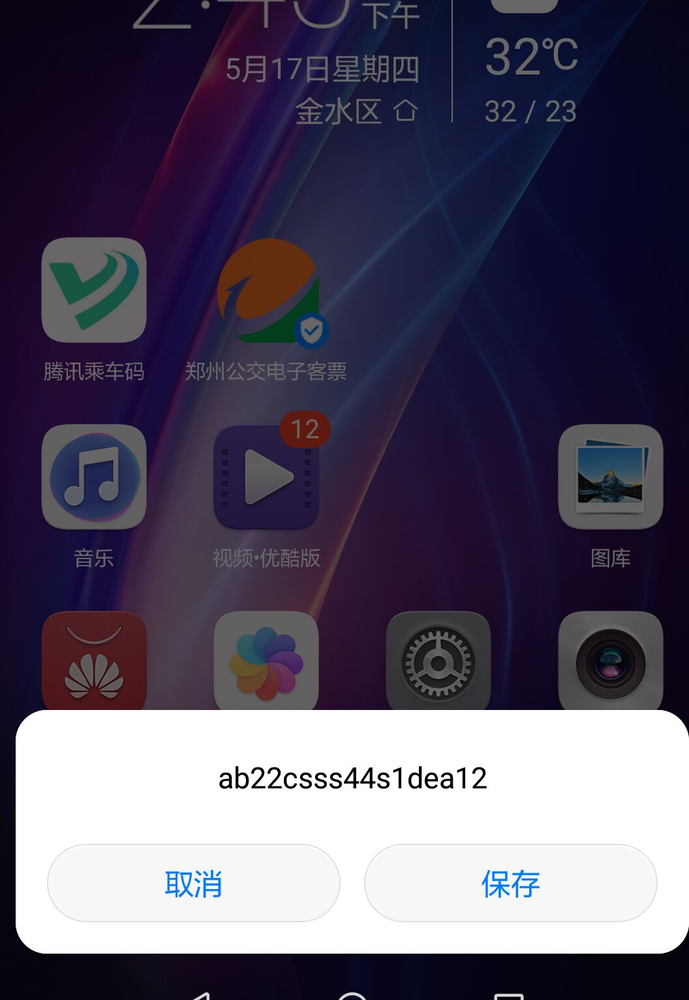

# CMPPGate , SMPPGate , SGIPGate, SMGPGate
中移短信cmpp协议/smpp协议 netty实现编解码

这是一个在netty4框架下实现的cmpp3.0/cmpp2.0短信协议解析及网关端口管理 (master分支是依赖于netty5的)。
代码copy了 `huzorro@gmail.com` 基于netty3.7的cmpp协议解析 [huzorro@gmail.com 的代码 ](https://github.com/huzorro/netty3ext)

目前已支持发送和解析`长文本短们拆分合并`，`WapPush短信`，以及`彩信通知`类型的短信。可以实现对彩信或者wap-push短信的拦截和加工处理。wap短信的解析使用 [smsj] (https://github.com/marre/smsj)的短信库

cmpp协议已经跟华为，东软，亚信的短信网关都做过联调测试，兼容了不同厂家的错误和异常，如果跟网关通信出错，可以打开trace日志查看二进制数据。

因要与短信中心对接，新增了对SMPP协议的支持。

SMPP的协议解析代码是从  [Twitter-SMPP 的代码](https://github.com/fizzed/cloudhopper-smpp) copy过来的。

新增对sgip协议(联通短信协议)的支持

sgip的协议解析代码是从 [huzorro@gmail.com 的代码 ](https://github.com/huzorro/sgipsgw) copy过来后改造的。

新增对smgp协议(电信短信协议)的支持

smgp的协议解析代码是从 [SMS-China 的代码 ](https://github.com/clonalman/SMS-China) copy过来后改造的。

支持发送彩信通知，WAP短信以及闪信(Flash Message):

<DIV>

<DIV>

## 性能测试 
在48core，128G内存的物理服务器上测试协议解析效率：35K条/s, cpu使用率25%. 

## Build
执行mvn package . jdk1.6以上. (如果用netty5则必须使用jdk1.7)

## 增加了业务处理API
业务层实现接口：BusinessHandlerInterface，或者继承AbstractBusinessHandler抽象类实现业务即可。 连接保活，消息重发，消息持久化，连接鉴权都已封装，不须要业务层再实现。

## 如何实现自己的Handler,比如按短短信计费
参考 CMPPChargingDemoTest 里的扩展位置

# 实体类说明

## CMPP的连接端口

`com.zx.sms.connect.manager.cmpp.CMPPEndpointEntity`
表示一个Tcp连接的发起端，或者接收端。用来记录连接的IP.port,以及CMPP协议的用户名，密码，业务处理的ChannelHandler集合等其它端口参数。包含三个字类：

1. com.zx.sms.connect.manager.cmpp.CMPPServerEndpointEntity
服务监听端口，包含一个List<CMPPServerChildEndpointEntity>属性。 一个服务端口包含多个CMPPServerChildEndpointEntity端口

2. com.zx.sms.connect.manager.cmpp.CMPPServerChildEndpointEntity
服务接收端口，包含CMPP连接用户名，密码，以及协议版本等信息

3. com.zx.sms.connect.manager.cmpp.CMPPClientEndpointEntity
客户端端口，包含CMPP连接用户名，密码，以及协议版本，以及服务端IP.port. 用于连接服务端

## 端口连接器接口
`com.zx.sms.connect.manager.EndpointConnector`
负责一个端口的打开，关闭，查看当前连接数，新增连接，移除连接。每个端口的实体类都对应一个EndpointConnector.当CMPP连接建立完成，将连接加入连接器管理，并给pipeLine上挂载业务处理的ChannelHandler.

1. com.zx.sms.connect.manager.cmpp.CMPPServerEndpointConnector
这个类的open()调用netty的ServerBootstrap.bind()开一个服务监听

2. com.zx.sms.connect.manager.cmpp.CMPPServerChildEndpointConnector
用来收集CMPPServerChildEndpointEntity端口下的所有连接。它的open()方法为空.

3. com.zx.sms.connect.manager.cmpp.CMPPClientEndpointConnector
这个类open()调用netty的Bootstrap.connect()开始一个TCP连接

## 端口管理器
`com.zx.sms.connect.manager.EndpointManager`
该类是单例模式，管理所有端口，并负责所有端口的打开，关闭，以及端口信息保存，以及连接断线重连。

## CMPP协议的连接登陆管理
`com.zx.sms.session.cmpp.SessionLoginManager`
这是一个netty的ChannelHandler实现，主要负责CMPP连接的建立。当CMPP连接建立完成后，会调用EndpointConnector.addChannel(channel)方法，把连接加入连接器管理，连接器负责给channel的pipeline上挂载业务处理的Handler,最后触发
SessionState.Connect事件，通知业务处理Handler连接已建立成功。

## CMPP的连接状态管理器
`com.zx.sms.session.cmpp.SessionStateManager`
这是一个netty的ChannelHandler实现。负责每个连接上CMPP消息的存储，短信重发，流量窗口控制，过期短信的处理

## CMPP协议解析器
CMPP20MessageCodecAggregator [2.0协议]
CMPPMessageCodecAggregator [这是3.0协议]
聚合了CMPP主要消息协议的解析，编码，长短信拆分，合并处理。

## 短信持久化存储实现 StoredMapFactory 
使用BDB的StoreMap实现消息持久化，防止系统意外丢失短信。

## 程序启动处理流程

1. 程序启动类 new 一个CMPPEndpointEntity的实体类并设置IP,port,用户名，密码，业务处理的Handler等参数,
2. 程序启动类 调用EndpointManager.addEndpointEntity(endpoint)方法，将端口加入管理器
3. 程序启动类 调用EndpointManager.openAll()或者EndpointManager.openEndpoint()方法打开端口。
4. EndpointManager会调用EndpointEntity.buildConnector()创建一个端口连接器，并调用EndpointConnector.open()方法打开端口。
5. 如果是CMPPClientEndpointEntity的话，就会向服务器发起TCP连接请求，如果是CMPPServerEndpointEntity则会在本机开启一个服务端口等客户端连接。
6. TCP连接建立完成后。netty会调用EndpointConnector.initPipeLine()方法初始化PipeLine，把CMPP协议解析器，SessionLoginManager加到PipeLine里去，然后netty触发ChannelActive事件。
7. 在SessionLoginManager类里，客户端收到ChannelActive事件后会发送一个CMPPConnnect消息，请求建立CMPP连接.
8. 同样在SessionLoginManager.channelRead()方法里,服务端会收到CMPPConnnect消息，开始对用户名，密码进行鉴权，并给客户端鉴权结果。
9. 鉴权通过后，SessionLoginManager调用EndpointConnector.addChannel(channel)方法，把channel加入ArrayList,并给pipeLine上挂载SessionStateManager和业务处理的ChannelHandler。
10. EndpointConnector.addChannel(channel)完成后，SessionLoginManager调用ctx.fireUserEventTriggered()方法，触发	SessionState.Connect事件。

以上CMPP连接建立完成。

11. 业务处理类收到SessionState.Connect事件，开始业务处理，如下发短信。
12. SessionStateManager会拦截所有read()和write()的消息，进行消息持久化，消息重发，流量控制。

## 增加同步调用api
smsgate自开发以来，一直使用netty的异步发送消息，但实际使用场景中同步发送消息的更方便，或者能方便的取到response。因此增加一个同步调用的api。即：发送消息后等接收到对应的响应后才完成。
使用方法如下：

```java

	//因为长短信要拆分，因此返回一个promiseList.每个拆分后的短信对应一个promise
	List<Promise> futures = ChannelUtil.syncWriteLongMsgToEntity("client",submitmessage);
	for(Promise  future: futures){
		//调用sync()方法，阻塞线程。等待接收response
		future.sync(); 
		//接收成功，如果失败可以获取失败原因，比如遇到连接突然中断错误等等
		if(future.isSuccess()){
			//打印收到的response消息
			logger.info("response:{}",future.get());
		}else{
			打印错误原因
			logger.error("response:{}",future.cause());
		}
	}

	//或者不阻塞进程，不调用sync()方法。
	List<Promise> promises = ChannelUtil.syncWriteLongMsgToEntity("client",submitmessage);
	for(Promise  promise: promises){
		//接收到response后回调Listener方法
		promise.addListener(new GenericFutureListener() {
			@Override
			public void operationComplete(Future future) throws Exception {
				//接收成功，如果失败可以获取失败原因，比如遇到连接突然中断错误等等
				if(future.isSuccess()){
					//打印收到的response消息
					logger.info("response:{}",future.get());
				}else{
					打印错误原因
					logger.error("response:{}",future.cause());
				}
			}
		});
	}

```

## CMPP Api使用举例

```java

public class TestCMPPEndPoint {
	private static final Logger logger = LoggerFactory.getLogger(TestCMPPEndPoint.class);

	@Test
	public void testCMPPEndpoint() throws Exception {
	
		final EndpointManager manager = EndpointManager.INS;

		CMPPServerEndpointEntity server = new CMPPServerEndpointEntity();
		server.setId("server");
		server.setHost("127.0.0.1");
		server.setPort(7891);
		server.setValid(true);
		//使用ssl加密数据流
		server.setUseSSL(false);
		
		CMPPServerChildEndpointEntity child = new CMPPServerChildEndpointEntity();
		child.setId("child");
		child.setChartset(Charset.forName("utf-8"));
		child.setGroupName("test");
		child.setUserName("901782");
		child.setPassword("ICP");

		child.setValid(true);
		child.setWindows((short)16);
		child.setVersion((short)0x20);

		child.setMaxChannels((short)20);
		child.setRetryWaitTimeSec((short)5);
		child.setMaxRetryCnt((short)3);
		child.setReSendFailMsg(false);
		//child.setReadLimit(200);
		List<BusinessHandlerInterface> serverhandlers = new ArrayList<BusinessHandlerInterface>();
		serverhandlers.add(new SessionConnectedHandler(300000));      //在这个类里发送短信
		child.setBusinessHandlerSet(serverhandlers);
		server.addchild(child);
		
		
		manager.addEndpointEntity(server);
	
		CMPPClientEndpointEntity client = new CMPPClientEndpointEntity();
		client.setId("client");
		client.setHost("127.0.0.1");
		client.setPort(7891);
		client.setChartset(Charset.forName("utf-8"));
		client.setGroupName("test");
		client.setUserName("901782");
		client.setPassword("ICP");


		client.setMaxChannels((short)12);
		client.setWindows((short)16);
		client.setVersion((short)0x20);
		client.setRetryWaitTimeSec((short)10);
		client.setUseSSL(false);
		client.setReSendFailMsg(false);
		//client.setWriteLimit(200);
		//client.setReadLimit(200);
		List<BusinessHandlerInterface> clienthandlers = new ArrayList<BusinessHandlerInterface>();
		clienthandlers.add( new MessageReceiveHandler());  //在这个类里接收短信消息
		client.setBusinessHandlerSet(clienthandlers);
		manager.addEndpointEntity(client);
		
		manager.openAll();
		//LockSupport.park();
       
		Thread.sleep(300000);
		EndpointManager.INS.close();
	}

```

## SMPP Api使用举例

```java

public class TestSMPPEndPoint {
	private static final Logger logger = LoggerFactory.getLogger(TestSMPPEndPoint.class);

	@Test
	public void testSMPPEndpoint() throws Exception {
	
		final EndpointManager manager = EndpointManager.INS;

		SMPPServerEndpointEntity server = new SMPPServerEndpointEntity();
		server.setId("server");
		server.setHost("127.0.0.1");
		server.setPort(2776);
		server.setValid(true);
		//使用ssl加密数据流
		server.setUseSSL(false);
		
		SMPPServerChildEndpointEntity child = new SMPPServerChildEndpointEntity();
		child.setId("child");
		child.setSystemId("901782");
		child.setPassword("ICP");

		child.setValid(true);
		child.setChannelType(ChannelType.DUPLEX);
		child.setMaxChannels((short)20);
		child.setRetryWaitTimeSec((short)30);
		child.setMaxRetryCnt((short)3);
		child.setReSendFailMsg(false);
		child.setIdleTimeSec((short)15);
		List<BusinessHandlerInterface> serverhandlers = new ArrayList<BusinessHandlerInterface>();
		serverhandlers.add(new SMPP2CMPPBusinessHandler());  //  将CMPP的对象转成SMPP对象，然后再经SMPP解码器处理
		serverhandlers.add( new MessageReceiveHandler());   // 复用CMPP的Handler
		child.setBusinessHandlerSet(serverhandlers);
		server.addchild(child);
		
		manager.addEndpointEntity(server);
		manager.openAll();
		
		SMPPClientEndpointEntity client = new SMPPClientEndpointEntity();
		client.setId("client");
		client.setHost("127.0.0.1");
		client.setPort(2776);
		client.setSystemId("901782");
		client.setPassword("ICP");
		client.setChannelType(ChannelType.DUPLEX);

		client.setMaxChannels((short)12);
		client.setRetryWaitTimeSec((short)100);
		client.setUseSSL(false);
		client.setReSendFailMsg(false);
		List<BusinessHandlerInterface> clienthandlers = new ArrayList<BusinessHandlerInterface>();
		clienthandlers.add(new SMPP2CMPPBusinessHandler()); //  将CMPP的对象转成SMPP对象，然后再经SMPP解码器处理
		clienthandlers.add(new SessionConnectedHandler(600000)); //// 复用CMPP的Handler ，在这个类里发送短信
		client.setBusinessHandlerSet(clienthandlers);
		
		manager.openEndpoint(client);
		
		//LockSupport.park();
		Thread.sleep(300000);
		EndpointManager.INS.close();
	}
	
```

## SGIP Api使用举例

```java
public class TestSgipEndPoint {
	private static final Logger logger = LoggerFactory.getLogger(TestSgipEndPoint.class);

	@Test
	public void testsgipEndpoint() throws Exception {
		ResourceLeakDetector.setLevel(Level.ADVANCED);
		final EndpointManager manager = EndpointManager.INS;

		SgipServerEndpointEntity server = new SgipServerEndpointEntity();
		server.setId("sgipserver");
		server.setHost("127.0.0.1");
		server.setPort(8801);
		server.setValid(true);
		//使用ssl加密数据流
		server.setUseSSL(false);
		
		SgipServerChildEndpointEntity child = new SgipServerChildEndpointEntity();
		child.setId("sgipchild");
		child.setLoginName("333");
		child.setLoginPassowrd("0555");

		child.setValid(true);
		child.setChannelType(ChannelType.DOWN);
		child.setMaxChannels((short)20);
		child.setRetryWaitTimeSec((short)30);
		child.setMaxRetryCnt((short)3);
		child.setReSendFailMsg(false);
		child.setIdleTimeSec((short)15);
		List<BusinessHandlerInterface> serverhandlers = new ArrayList<BusinessHandlerInterface>();
		
		serverhandlers.add(new SgipReportRequestMessageHandler());
		serverhandlers.add(new Sgip2CMPPBusinessHandler());  //  将CMPP的对象转成sgip对象，然后再经sgip解码器处理
		serverhandlers.add(new MessageReceiveHandler());   // 复用CMPP的Handler
		child.setBusinessHandlerSet(serverhandlers);
		server.addchild(child);
		
		manager.addEndpointEntity(server);
		
		
		SgipClientEndpointEntity client = new SgipClientEndpointEntity();
		client.setId("sgipclient");
		client.setHost("127.0.0.1");
		client.setPort(8001);
		client.setLoginName("333");
		client.setLoginPassowrd("0555");
		client.setChannelType(ChannelType.DOWN);

		client.setMaxChannels((short)12);
		client.setRetryWaitTimeSec((short)100);
		client.setUseSSL(false);
		List<BusinessHandlerInterface> clienthandlers = new ArrayList<BusinessHandlerInterface>();
		clienthandlers.add(new Sgip2CMPPBusinessHandler()); //  将CMPP的对象转成sgip对象，然后再经sgip解码器处理
		clienthandlers.add(new SessionConnectedHandler(1)); //// 复用CMPP的Handler ，在这个类里发送短信
		client.setBusinessHandlerSet(clienthandlers);
		manager.addEndpointEntity(client);
		manager.openAll();
		//LockSupport.park();
        System.out.println("start.....");
        
		Thread.sleep(300000);
		EndpointManager.INS.close();
	}
}
```

## Demo 执行日志

```

11:31:52.842 [workGroup2] INFO  c.z.s.c.m.AbstractEndpointConnector - handlers is not shareable . clone it success. com.zx.sms.codec.smpp.SMPP2CMPPBusinessHandler@1d7059df
11:31:52.852 [workGroup1] INFO  c.z.s.c.m.AbstractEndpointConnector - handlers is not shareable . clone it success. com.zx.sms.codec.smpp.SMPP2CMPPBusinessHandler@75e134be
11:31:52.852 [workGroup1] INFO  c.z.s.c.m.AbstractEndpointConnector - handlers is not shareable . clone it success. com.zx.sms.handler.api.gate.SessionConnectedHandler@aa80b58
11:31:52.869 [workGroup1] INFO  c.z.s.s.AbstractSessionLoginManager - login in success on channel [id: 0xfdc7b81e, L:/127.0.0.1:11481 - R:/127.0.0.1:2776]
11:31:52.867 [workGroup2] INFO  c.z.s.s.AbstractSessionLoginManager - login in success on channel [id: 0x1fba3767, L:/127.0.0.1:2776 - R:/127.0.0.1:11481]
11:31:53.863 [busiWork-3] INFO  c.z.s.h.a.s.MessageReceiveHandler - Totle Receive Msg Num:343,   speed : 343/s
11:31:54.872 [busiWork-1] INFO  c.z.s.h.a.s.MessageReceiveHandler - Totle Receive Msg Num:1381,   speed : 1038/s
11:31:55.873 [busiWork-8] INFO  c.z.s.h.a.s.MessageReceiveHandler - Totle Receive Msg Num:2704,   speed : 1323/s
11:31:56.875 [busiWork-2] INFO  c.z.s.h.a.s.MessageReceiveHandler - Totle Receive Msg Num:4010,   speed : 1306/s
11:31:57.880 [busiWork-5] INFO  c.z.s.h.a.s.MessageReceiveHandler - Totle Receive Msg Num:5416,   speed : 1406/s
11:31:58.881 [busiWork-7] INFO  c.z.s.h.a.s.MessageReceiveHandler - Totle Receive Msg Num:7442,   speed : 2026/s
11:31:59.882 [busiWork-8] INFO  c.z.s.h.a.s.MessageReceiveHandler - Totle Receive Msg Num:9581,   speed : 2139/s
11:32:00.883 [busiWork-2] INFO  c.z.s.h.a.s.MessageReceiveHandler - Totle Receive Msg Num:12865,   speed : 3284/s
11:32:01.884 [busiWork-5] INFO  c.z.s.h.a.s.MessageReceiveHandler - Totle Receive Msg Num:15937,   speed : 3072/s
11:32:02.886 [busiWork-5] INFO  c.z.s.h.a.s.MessageReceiveHandler - Totle Receive Msg Num:19489,   speed : 3552/s
11:32:03.887 [busiWork-6] INFO  c.z.s.h.a.s.MessageReceiveHandler - Totle Receive Msg Num:23065,   speed : 3576/s
11:32:04.888 [busiWork-2] INFO  c.z.s.h.a.s.MessageReceiveHandler - Totle Receive Msg Num:26337,   speed : 3272/s

```


